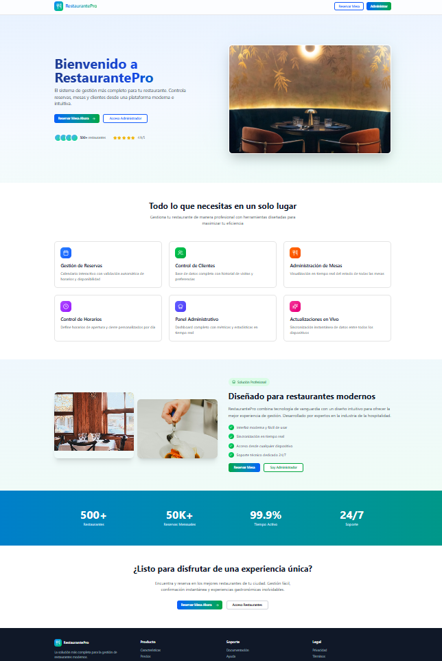

# 🍽️ RestaurantePro -- Sistema Web de Gestión para Restaurantes

RestaurantePro es una aplicación web moderna desarrollada para la
gestión básica de restaurantes. El sistema permite administrar reservas
y ofrecer una experiencia interactiva mediante una interfaz dinámica
construida con tecnologías modernas del ecosistema JavaScript.

Este proyecto tiene un enfoque educativo y profesional, aplicando buenas
prácticas de arquitectura frontend, modularidad, mantenibilidad y
escalabilidad.

------------------------------------------------------------------------

## 📌 Tabla de Contenido

1.  Descripción General
2.  Objetivos del Proyecto
3.  Características
4.  Tecnologías Utilizadas
5.  Arquitectura del Sistema
6.  Estructura del Proyecto
7.  Instalación y Configuración
8.  Scripts Disponibles
9.  Flujo de Funcionamiento
10. Buenas Prácticas Implementadas
11. Mejoras Futuras
12. Contribuciones
13. Licencia
14. Autor

------------------------------------------------------------------------

## 📖 Descripción General

RestaurantePro es un sistema web básico orientado a restaurantes que
permite:

-   Mostrar información del restaurante.
-   Gestionar reservas.
-   Proporcionar una experiencia SPA (Single Page Application).
-   Ejecutarse en entorno local mediante servidor moderno.

El sistema está diseñado para servir como base escalable hacia
soluciones empresariales más completas.

------------------------------------------------------------------------

## 🎯 Objetivos del Proyecto

### Objetivo General

Desarrollar una aplicación web moderna que simule la gestión básica de
un restaurante utilizando tecnologías actuales del desarrollo frontend.

### Objetivos Específicos

-   Implementar arquitectura modular.
-   Aplicar TypeScript en un proyecto real.
-   Utilizar Vite como herramienta de construcción.
-   Crear una interfaz responsive.
-   Facilitar el mantenimiento del código.

------------------------------------------------------------------------

## 🚀 Características Principales

✅ Aplicación SPA sin recargas\
✅ Arquitectura modular basada en componentes\
✅ Desarrollo rápido con Vite\
✅ Interfaz responsive\
✅ Código organizado y escalable\
✅ Hot Reload durante desarrollo\
✅ Separación de responsabilidades

------------------------------------------------------------------------

## 🧱 Tecnologías Utilizadas

  Categoría              Tecnología
  ---------------------- -------------
  Lenguaje               TypeScript
  Frontend               HTML5, CSS3
  Bundler                Vite
  Runtime                Node.js
  Gestor de paquetes     npm
  Control de versiones   Git
  Repositorio            GitHub

------------------------------------------------------------------------

## 🏗️ Arquitectura del Sistema

El sistema sigue una arquitectura modular basada en capas:

### 1. Capa de Presentación

Responsable de la interfaz gráfica y la interacción con el usuario.

### 2. Capa de Lógica

Gestiona eventos, estados y comportamiento dinámico.

### 3. Capa de Configuración

Incluye configuración del entorno, bundler y dependencias.

Beneficios:

-   Escalabilidad
-   Reutilización de componentes
-   Mantenibilidad
-   Separación clara de responsabilidades

------------------------------------------------------------------------

## 📂 Estructura del Proyecto

    restaurantepro/
    │
    ├── src/
    │   ├── assets/          # Imágenes y recursos
    │   ├── components/      # Componentes reutilizables
    │   ├── styles/          # Archivos CSS
    │   └── main.ts          # Punto de entrada
    │
    ├── index.html           # HTML principal
    ├── package.json         # Dependencias
    ├── vite.config.ts       # Configuración Vite
    └── README.md
    └── home.png


------------------------------------------------------------------------

## ⚙️ Instalación y Configuración

### 1️⃣ Clonar repositorio

``` bash
git clone https://github.com/zcrypt83/restaurantepro.git
cd restaurantepro
```

### 2️⃣ Instalar dependencias

``` bash
npm install
```

### 3️⃣ Ejecutar servidor de desarrollo

``` bash
npm run dev
```


## 📸 Vista del Sistema



Abrir en navegador:

    http://localhost:5173

------------------------------------------------------------------------

## 🧑‍💻 Scripts Disponibles

  Script            Descripción
  ----------------- --------------------------------
  npm run dev       Ejecuta servidor de desarrollo
  npm run build     Genera versión producción
  npm run preview   Previsualiza build

------------------------------------------------------------------------

## 🔄 Flujo de Funcionamiento

1.  Usuario accede a la aplicación.
2.  Se carga la interfaz principal.
3.  El usuario interactúa con las secciones.
4.  Eventos JavaScript actualizan dinámicamente el DOM.
5.  No existen recargas completas de página.

------------------------------------------------------------------------

## ✅ Buenas Prácticas Implementadas

-   Separación de responsabilidades.
-   Código modular.
-   Uso de TypeScript para tipado fuerte.
-   Organización por carpetas.
-   Configuración moderna con Vite.
-   Diseño responsive.

------------------------------------------------------------------------

## 🔮 Mejoras Futuras

-   Sistema de autenticación.
-   Panel administrativo.
-   Base de datos integrada.
-   API REST.
-   Gestión de menú.
-   Sistema de pedidos online.
-   Dashboard analítico.
-   Deploy en la nube.

------------------------------------------------------------------------

## 🤝 Contribuciones

Las contribuciones son bienvenidas:

1.  Fork del repositorio.
2.  Crear una rama:

``` bash
git checkout -b feature/nueva-funcionalidad
```

3.  Commit cambios.
4.  Push.
5.  Crear Pull Request.

------------------------------------------------------------------------

## 📄 Licencia

Distribuido bajo licencia MIT.

------------------------------------------------------------------------

## 👨‍💻 Autor

**zcrypt83**\
GitHub: https://github.com/zcrypt83

------------------------------------------------------------------------

## ⭐ Apoya el Proyecto

Si el proyecto te resulta útil:

-   ⭐ Dale una estrella al repositorio
-   🍴 Haz fork y mejora el sistema

------------------------------------------------------------------------
